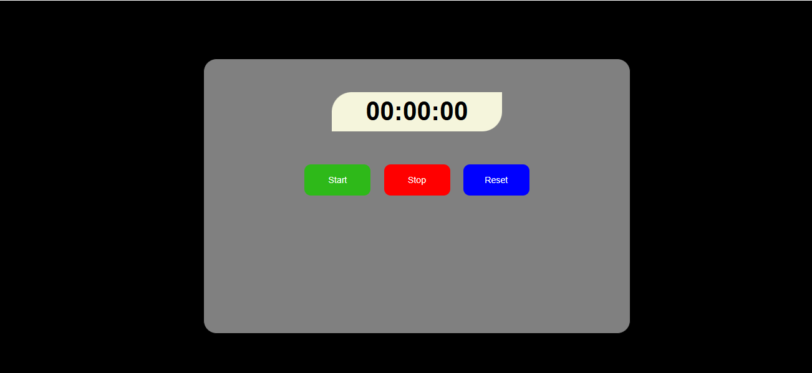

# ⏱️ Stopwatch Web App

A simple stopwatch application built using **HTML**, **CSS**, and **JavaScript** as part of my **Credora Internship**.

## 🚀 Features
- Start, Stop, and Reset the timer
- Responsive and clean UI
- Built using vanilla JavaScript

## 📂 Folder Structure
credora-stopwatch/
├── index.html
├── style.css
├── script.js
└── README.md

## 📸 Screenshot

## 🔧 How to Run
1. Clone the repository:
git clone https://github.com/manthandhote/credora-stopwatch.git
Open index.html in your browser.

🛠️ Technologies Used
HTML5

CSS3

JavaScript (Vanilla)
